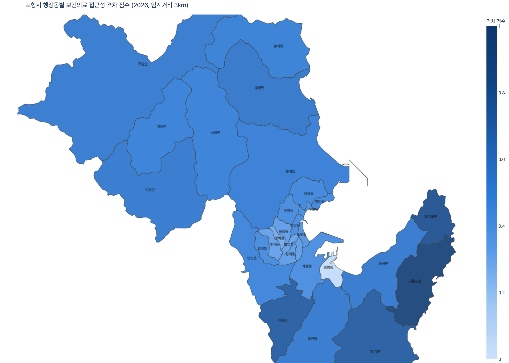

# 포항시 외국인 주민 의료 인프라 격차 분석 보고서

생성일 2026-10-08 · 본문 생성 모델 `nvidia/nemotron-3-super-120b-a12b` · `scripts/run_pipeline.py --stage report`

> 이 보고서의 **본문(1~6절)은 LLM이 자동 생성**했다. 본문의 모든 수치는 파이프라인 산출물·공개 실태조사 수치와 코드로 대조해 통과한 것만 남겼고(1~10의 정수는 대조 제외), 사실 주장은 별도 LLM 호출로 사실 시트와 한 번 더 대조했다. 그래도 해석과 정책 제안의 타당성은 사람이 검수해야 한다. 아래 부록의 표와 지도는 LLM을 거치지 않았다.

## 1. 핵심 요약  
포항시 29개 행정동의 총인구는 496,653명이며 외국인 주민은 7,946명으로 전체의 1.6%를 차지한다. 의료 인프라 단일 지수를 기반으로 한 2SFCA 접근성 분석(기본 임계거리 3km)을 통해 산출된 격차 점수는 0~1 사이이며, 점수가 높을수록 의료 접근 격차가 심각함을 나타낸다. 격차 점수 순위에 따라 최우선 구간(1~8위)에는 남구 6개동(구룡포읍, 호미곶면, 장기면, 대송면, 동해면, 오천읍)과 북구 2개동(청하면, 기계면)이 포함된다. 주의 구간(9~15위)은 남구 1개동(연일읍)과 북구 6개동으로 구성되며, 보통 구간(16~22위)과 양호 구간(23~29위)은 각각 남구 3개동·북구 4개동과 남구 4개동·북구 3개동으로 나뉜다. 상위 5개동의 소속 구 분포는 남구 4개동(구룡포읍, 호미곶면, 장기면, 대송면)과 북구 1개동(청하면)이다. 접근성 순위 최하위(27위, 동률)는 동해면, 기계면, 죽장면이며, 1위는 청림동이다. 외국인 비율이 가장 높은 행정동은 구룡포읍(15.1%)이고 외국인 수가 가장 많은 행정동도 구룡포읍(1,147명)이다. 구별 평균 격차 점수는 남구가 0.503, 북구가 0.457이며, 남구에 최우선 구간이 6개, 북구에 최우선 구간이 2개 분포되어 있다.

## 2. 격차 분포와 주요 발견  
격차 점수는 최우선 구간에서 0.945(구룡포읍)부터 0.542(기계면)까지 분포하며, 주의 구간에서는 0.540(죽장면)에서 0.468(장량동)까지, 보통 구간에서는 0.465(환여동)에서 0.388(송도동)까지, 양호 구간에서는 0.343(해도동)에서 0.045(청림동)까지 나타난다. 구간별 구성에 따라 최우선 구간은 남구 6개동과 북구 2개동으로 이루어지고, 주의 구간은 남구 1개동과 북구 6개동으로 구성된다. 보통 구간은 남구 3개동과 북구 4개동, 양호 구간은 남구 4개동과 북구 3개동으로 나뉜다. 주요 사실에 따르면 접근성 순위 최하위(27위, 동률)는 동해면, 기계면, 죽장면이며, 접근성 순위 1위는 청림동이다. 외국인 비율 최고는 구룡포읍(15.1%)이고 외국인 수 최다는 구룡포읍(1,147명)이다. 남구의 평균 격차 점수(0.503)는 북구의 평균 격차 점수(0.457)보다 높으며, 남구에 최우선 구간이 6개, 북구에 최우선 구간이 2개 위치해 있다.

## 3. 우선 개선 대상 지역 해석  
최우선 구간 상위 5개동은 구룡포읍(0.945), 호미곶면(0.792), 장기면(0.727), 대송면(0.720), 청하면(0.563)이다. 이들 지역은 외국인 비율이 상대적으로 높으며(구룡포읍 15.1%, 호미곶면 10.9%, 장기면 7.3%, 대송면 7.1%, 청하면 3.8%) 접근성 순위가 낮다(구룡포읍 18위, 호미곶면 15위, 장기면 25위, 대송면 24위, 청하면 19위). 정책 카드 요지에 따르면 구룡포읍은 지역 농협과 연계한 주간 이동 보건진료소 운영, 다국어 건강 상담 인력 배치, 월 1회 보건소 협력 기본 건강 검진 및 예방접종 안내 회의를 제안한다. 호미곶면은 순회 보건 인력의 정기 방문과 기본 건강 검진·통역 지원을 제시한다. 장기면은 주 1회 외국인 전용 진료 시간 운영, 건강 상담 키오스크 설치, 간호사의 월 2회 방문 기본 검진 및 건강 상담을 포함한다. 대송면은 주 2회 순회 다국어 의료진 배치, 정기적인 건강 검진 및 언어 맞춤형 건강 교육, 이동식 건강 버스를 통한 월 1회 방문 진료를 제안한다. 청하면은 정책 카드 요지에 구체적인 내용이 없으나, 외국인 비율이 3.8%이며 접근성 순위가 19위임을 고려해 유사한 접근이 필요할 수 있다.

## 4. 결과의 안정성  
임계거리 민감도에 따르면 임계거리를 1km, 3km, 5km로 변경해 재계산한 결과, 29개 행정동 중 25개에서 순위가 적어도 한 번 바뀌었다. 이는 결과가 임계거리 선택에 어느 정도 민감함을 시사한다. 그러나 기본 임계거리 상위 5개동(구룡포읍, 호미곶면, 장기면, 대송면, 청하면) 중 구룡포읍, 호미곶면, 장기면, 대송면은 모든 임계거리에서 상위 5위 안에 지속적으로 머물렀다. 이들 네 개동의 순위는 1km, 3km, 5km 조건에서 각각 1위~4위를 유지했으며, 청하면은 5km 조건에서 6위로 한 단계 하락했다. 따라서 가장 높은 격차를 보이는 네 개동은 임계거리 변화에 상대적으로 안정적인 것으로 보인다.

## 5. 정책 시사점  
정책 카드 요지를 종합하면, 우선적으로 이동형 보건 서비스와 다국어 인력 확대가 효과적일 수 있다. 구룡포읍과 호미곶면은 순회 또는 이동 보건 인력을 통한 정기 방문과 기본 건강 검진을 제시하며, 장기면은 보건지소 내 외국인 전용 진료 시간과 건강 상담 키오스크 설치를 통해 접근성을 높이는 방안을 포함한다. 대송면은 이동식 건강 버스를 활용해 임계거리 내 가정에 월 1회 방문 진료를 제공함으로써 교통 인프라가 부족한 면 지역의 한계를 보완하려 한다. 이들 제안은 외국인 비율이 높고 접근성이 낮은 지역에 맞춤형 서비스를 제공함으로써 의료 이용 장벽을 낮출 수 있는 방향성을 제시한다. 다만, 각 카드에 명시된 구체적 내용 외에 추가적인 효과나 인과 관계를 단정해서는 안 되며, 제시된 사항은 해당 행정동의 특성을 반영한 예시로 이해해야 한다.

## 6. 한계와 유의사항  
본 분석은 경상북도 외국인주민 및 다문화가족 실태조사(경북 1권역)와 전국다문화가족실태조사라는 두 가지 배경 근거에 의존하며, 이들 조사는 포항시 단독 수치가 아니다. 따라서 경북(권역) 조사에 따른 수치나 전국 조사에 따른 수치를 인용할 때는 출처를 명확히 밝혀야 한다. 또한 의료 인프라 단일 지수만을 사용했기에 다른 사회경제적 요인이나 보건행정 서비스별 차이는 반영되지 않았다. 격차 점수의 산출 방식(정규화와 가중치) 역시 주관적인 선택에 기인하므로, 다른 가중치나 정규화 방법을 적용하면 순위가 달라질 수 있다. 임계거리 민감도 분석에서 대부분의 행정동이 순위 변동을 보인 점은 접근성 측정 방식에 따른 불확실성을 시사한다. 따라서 정책 제언은 이러한 한계를 인지한 채, 추가적인 지역별 현장 조사와 다차원적 지표 보완을 통해 검증될 필요가 있다.

---

## 부록 A. 행정동별 격차 점수 (코드 생성)

| 순위 | 행정동 | 구 | 격차 점수 | 구간 | 외국인 비율 | 접근성 순위 |
|---|---|---|---|---|---|---|
| 1 | 구룡포읍 | 남구 | 0.945 | 최우선 | 15.1% | 18 |
| 2 | 호미곶면 | 남구 | 0.792 | 최우선 | 10.9% | 15 |
| 3 | 장기면 | 남구 | 0.727 | 최우선 | 7.3% | 25 |
| 4 | 대송면 | 남구 | 0.720 | 최우선 | 7.1% | 24 |
| 5 | 청하면 | 북구 | 0.563 | 최우선 | 3.8% | 19 |
| 6 | 동해면 | 남구 | 0.544 | 최우선 | 1.6% | 27 |
| 7 | 오천읍 | 남구 | 0.542 | 최우선 | 1.6% | 26 |
| 8 | 기계면 | 북구 | 0.542 | 최우선 | 1.6% | 27 |
| 9 | 죽장면 | 북구 | 0.540 | 주의 | 1.5% | 27 |
| 10 | 흥해읍 | 북구 | 0.516 | 주의 | 1.7% | 22 |
| 11 | 송라면 | 북구 | 0.507 | 주의 | 3.1% | 12 |
| 12 | 신광면 | 북구 | 0.501 | 주의 | 1.3% | 21 |
| 13 | 기북면 | 북구 | 0.499 | 주의 | 1.0% | 23 |
| 14 | 연일읍 | 남구 | 0.479 | 주의 | 1.3% | 20 |
| 15 | 장량동 | 북구 | 0.468 | 주의 | 1.3% | 16 |
| 16 | 환여동 | 북구 | 0.465 | 보통 | 1.0% | 17 |
| 17 | 우창동 | 북구 | 0.438 | 보통 | 0.5% | 14 |
| 18 | 효곡동 | 남구 | 0.437 | 보통 | 1.4% | 11 |
| 19 | 중앙동 | 북구 | 0.434 | 보통 | 1.9% | 10 |
| 20 | 두호동 | 북구 | 0.427 | 보통 | 0.8% | 13 |
| 21 | 제철동 | 남구 | 0.425 | 보통 | 2.0% | 9 |
| 22 | 송도동 | 남구 | 0.388 | 보통 | 1.5% | 8 |
| 23 | 해도동 | 남구 | 0.343 | 양호 | 0.9% | 6 |
| 24 | 용흥동 | 북구 | 0.337 | 양호 | 0.6% | 7 |
| 25 | 상대동 | 남구 | 0.336 | 양호 | 1.1% | 4 |
| 26 | 죽도동 | 북구 | 0.325 | 양호 | 1.2% | 3 |
| 27 | 대이동 | 남구 | 0.324 | 양호 | 0.7% | 5 |
| 28 | 양학동 | 북구 | 0.287 | 양호 | 0.3% | 2 |
| 29 | 청림동 | 남구 | 0.045 | 양호 | 1.7% | 1 |

## 부록 B. 격차 점수 지도

