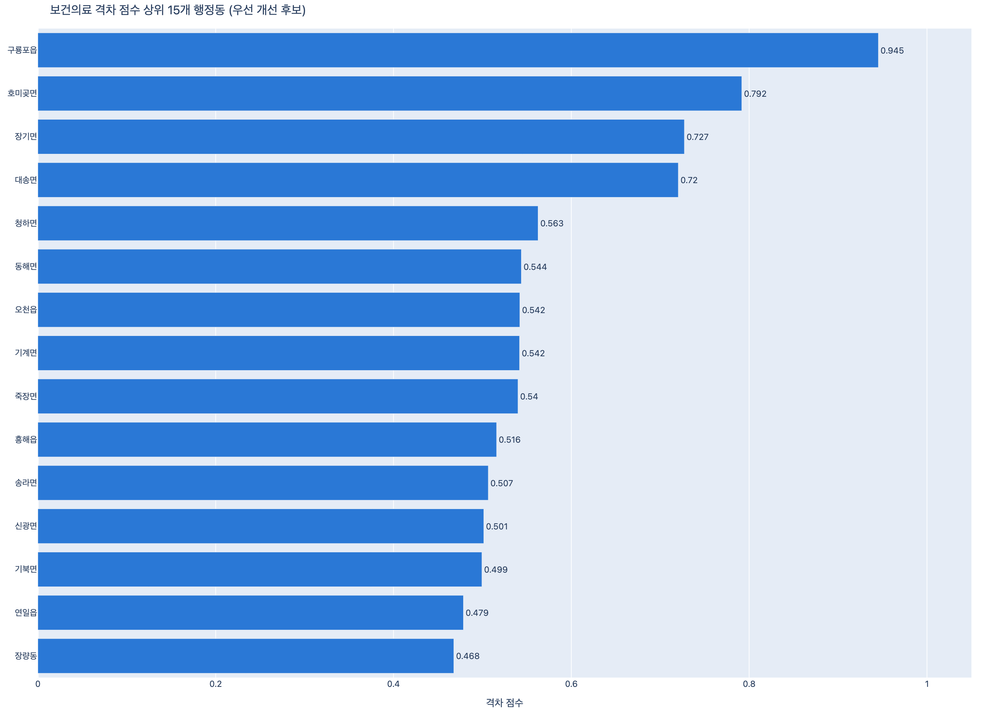
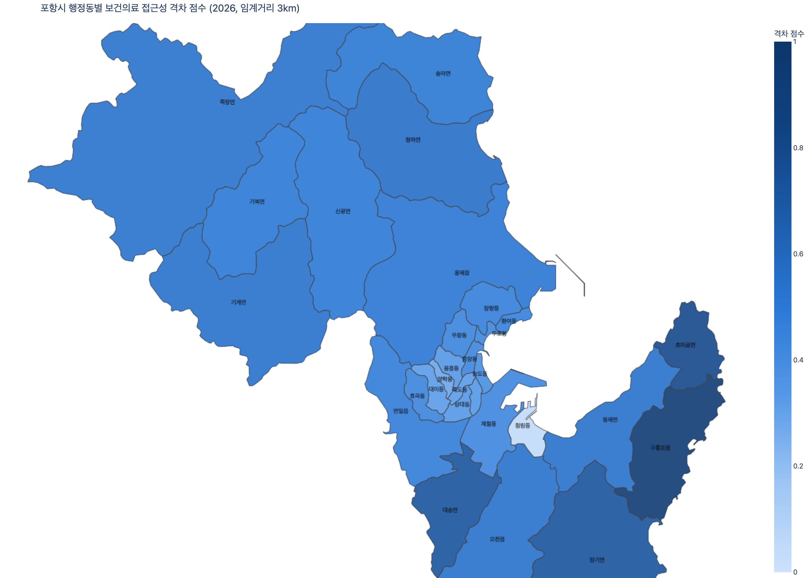

# 포항 외국인 주민 생활 인프라 격차 진단·정책생성 시스템

### Infrastructure Gap Atlas & AI Policy Co-pilot

2026 한동 AI·SW 페스티벌 — 스마트 SW 공모전 SW융합 부문 연구보고서

팀 구성: 컴퓨터공학심화 · 글로벌매니지먼트 · AI융합

---

## 요약

포항시는 포스코와 영일만산업단지를 중심으로 한 산업도시로, 제조·중공업 인력 수요를 채우기 위한 외국인 주민 유입이 구조적으로 지속되고 있다. 그러나 이들이 '일하는 곳'에 대한 데이터는 풍부한 반면 '사는 곳'의 생활 인프라 여건은 체계적으로 분석된 적이 없다. 본 프로젝트는 공공데이터만으로 포항시 29개 행정동 단위의 외국인 주민 생활 인프라 격차를 정량화하는 파이프라인을 구축하고, 이를 정책 리포트로 자동 생성하는 의사결정 지원 시스템을 목표로 한다.

이 보고서는 개념 설계에 그치지 않고 실제 공공데이터(KOSIS·SGIS·심평원·소상공인시장진흥공단) 기준 **29,083건의 시설 데이터**와 **29개 행정동의 인구 데이터**를 수집·정제해 2SFCA(Two-Step Floating Catchment Area) 접근성 지수와 격차 점수(Gap Score)를 실제로 산출한 결과를 담고 있다. 핵심 결과: 임계거리(1/3/5km)를 무엇으로 잡느냐에 따라 개별 행정동 순위는 크게 흔들리지만, 수요(외국인 비율)와 접근성 결핍을 결합한 격차 점수의 **최우선 개선 대상 상위권(구룡포읍·호미곶면·장기면·대송면)은 임계거리와 무관하게 안정적으로 유지된다.** 이는 단일 지표의 불안정성이라는 한계 안에서도 데이터가 실제로 뒷받침하는 결론이 무엇인지를 가려내는 작업이었다.

---

## 1. 문제 정의

### 1.1 배경 — 포항이라는 맥락

포항은 인구 감소·고령화가 진행되는 지방 중소도시이면서 동시에, 내국인만으로는 산업 인력 수요를 충족하기 어려운 구조적 압력에 놓인 산업도시다. 외국인 주민은 지역 산업을 떠받치는 핵심 인력이지만, 정주 여건이 나쁘면 지역을 이탈하고 이는 곧 지역 노동력 위기로 이어진다.

### 1.2 풀고자 하는 문제

의료기관·생활 상권 같은 기초 생활 인프라가 외국인 주민의 실제 거주지에 충분한지가 핵심 질문이다. 외국인 주민은 언어 장벽과 정보 접근성 한계 때문에 같은 인프라 부족 상황에서도 내국인보다 큰 불이익을 겪는다 — 본 프로젝트가 정의하는 **생활권 격차(Living-area Gap)** 문제다. "어느 지역의 정주 여건을 우선 개선해야 하는가"라는 행정·정책 질문에 데이터로 답하는 것이 목표다.

### 1.3 기존 접근과의 차별성

'지역 인프라 분석'이나 '의료 접근성 지도'는 이미 존재하는 주제다. 본 프로젝트는 다음 네 가지로 구분된다.

1. **대상의 특수성** — 분석 단위를 '전체 주민'이 아니라 '외국인 주민'으로 좁혔다. 같은 인프라라도 언어·정보 취약 계층의 체감 격차는 다르다.
2. **분석이 아니라 진단 엔진** — 결과물이 정적 보고서가 아니라, 격차 산출을 자동화한 재사용 가능한 파이프라인이다(`scripts/run_pipeline.py`).
3. **정량 + 정성 결합을 지향** — 공간 데이터(격차)와 실태조사 기반 수요 신호(체감 결핍)를 함께 보는 것을 목표로 설계했다. 이번 보고서 시점에는 정량 축(2SFCA·Gap Score)이 완성되었고, 정성 축(NLP 수요 추출)은 외부 데이터 접근 제약으로 진행 중이다 — 이 한계는 §6에서 정직하게 다룬다.
4. **로컬 검증 + 범용 확장** — 포항에서 검증하되, 임계거리·가중치·대상 행정동을 전부 `config/` YAML로 외부화해 울산·창원·거제 등 다른 외국인 밀집 산업도시로 이식 가능하게 설계했다. 코드에는 포항 관련 상수를 하드코딩하지 않는다.

---

## 2. 데이터와 리스크 관리

### 2.1 사용 데이터

크롤링이나 비공개 API를 쓰지 않는다 — 전부 파일/공개 API 형태로 확보된 데이터다.

| 데이터 | 출처 | 확보 상태 |
|---|---|---|
| 지자체 외국인주민현황·주민등록인구 (행정동 단위) | KOSIS `DT_216N_B000J2` | ✅ 29개 행정동 전체, 2025년 기준 총인구 496,653명·외국인 7,946명 |
| 행정동 경계 폴리곤 | 통계청 SGIS `hadmarea.geojson` | ✅ 29개 행정동, EPSG:5179 |
| 의료기관 현황(병원·약국) | 심평원(data.go.kr) | ✅ 908건 (병원 671·약국 237) |
| 상가(상권)정보 | 소상공인시장진흥공단(data.go.kr) | ✅ 28,175건 (의료·금융 제외) |
| 다문화가족실태조사 | MDIS | ⬜ 로그인 필요 — 현재 유일한 미확보 데이터 |

### 2.2 외국인 인구 데이터 확보 — 3단 방어선

프로젝트 전제(행정동 단위 외국인 데이터)가 무너지지 않도록 단계적 대비책을 뒀다: ① 행정동 단위 KOSIS 통계 직접 사용 → ② 불가하면 시·군·구 단위 + 실태조사 결합 → ③ 그래도 불가하면 분석 단위를 외국인 주민 전체로 확장. 실제로는 1단계(①)가 그대로 성립해 별도 완화 조치 없이 진행할 수 있었다(§3.1).

### 2.3 실제 파이프라인 구축 중 드러난 리스크 — 계획에 없던 문제들

개념 설계 단계에서 예상했던 리스크(§2.2) 외에, 실제 데이터를 열어보고서야 드러난 문제가 여럿 있었다. 이를 숨기지 않고 기록하는 것 자체가 "데이터를 실제로 다뤘는가"에 대한 증거라고 판단해 그대로 남긴다.

- **행정동 코드의 신·구 혼재.** KOSIS 코드 체계 안에 죽도동/죽도1·2동, 해도동/해도1·2동, 상대동/상대1·2동처럼 과거 분동·통합 이력이 현재 코드와 함께 남아 있었다. 위키백과 행정구역 개편 이력과 교차 검증해 현재 유효한 **29개 행정동**(4읍·10면·15행정동)만 추려 `data/processed/adm_code_map.csv`로 고정했다. 이 매핑 없이 시설 데이터를 조인했다면 죽도동 인구와 죽도1·2동 시설 좌표가 서로 다른 폴리곤에 잘못 배정될 뻔했다.
- **법정동 ≠ 행정동.** 심평원 데이터의 `읍면동` 컬럼은 행정동이 아니라 법정동 단위였다(예: 남빈동·대신동 등 8개 법정동이 전부 중앙동 하나에 속함). 법정동→행정동 매핑 테이블(`data/processed/legal_dong_to_admin.csv`)을 별도로 구축해 908건 전부 매칭했다(미매칭 0건).
- **행안부 코드 ≠ 통계청 코드.** 상가정보 API는 통계청 코드(경북=`37`)가 아니라 행안부 법정동코드(경북=`47`)를 쓴다는 것을 반복적인 `NODATA_ERROR` 끝에 발견했다. 코드 매핑 대신 좌표 반경검색 + point-in-polygon으로 문제를 우회했다(§3.2).
- **"금융" 데이터가 존재하지 않음.** 상가정보 API는 분류 체계상 금융업 코드가 있지만 포항 전역 조회 결과 실제 레코드가 0건이었다. 금융결제원 금융MAP(기관 계약 필요)·금융위 공개 데이터(좌표 없음) 등 대체 소스도 조사했으나 셀프서비스로 즉시 쓸 수 있는 좌표 단위 공개 데이터를 찾지 못해, **M2 범위를 "의료" 단일 접근성 지수로 좁히기로 결정했다**(2026-08-26). `build_accessibility()`는 공급 0건 도메인을 에러 없이 건너뛰도록 설계해, 향후 금융 데이터를 확보하면 `config/pipeline.yaml`에 도메인을 추가하는 것만으로 코드 변경 없이 계산이 확장된다 — 파라미터 외부화 설계 원칙(§1.4)이 실제로 값을 증명한 지점이다.

---

## 3. 방법론

### 3.1 파이프라인 개요

```
데이터 수집·정제 → 수요·공급 정량화 → 접근성 모델링(2SFCA) → 격차 점수 산출
        ↘                                                              ↘
   [완료]                                                    NLP 수요 추출 → LLM 정책 리포트
                                                                  [MDIS 대기]      [대기]
                                                              ↓
                                                        진단 시각화 [완료]
```

수집부터 격차 점수·시각화까지는 실제 데이터로 동작하는 코드로 구현되어 있다(`scripts/run_pipeline.py --stage {ingest,preprocess,access,gap,viz}`). NLP·LLM 두 단계만 외부 데이터 접근 제약으로 대기 중이다.

### 3.2 접근성 모델링 — 2SFCA

2SFCA(Two-Step Floating Catchment Area)는 공간 접근성 분석의 검증된 기법이다.

1. **1단계**: 각 시설 j의 공급/수요 비율 `R_j = capacity_j / Σ(임계거리 내 인구)`.
2. **2단계**: 각 행정동 i에서 도달 가능한 시설들의 비율 합 `A_i = Σ(임계거리 내 R_j)` — 이것이 접근성 지수(`access_index`).

거리는 직선거리(EPSG:5179, `scipy.spatial.cKDTree`)로 계산한다. README가 명시한 원칙대로 교통량 데이터는 "있으면 정밀도를 높이는 선택 옵션"으로 격하해, 데이터 확보 실패가 시스템 전체를 멈추지 않게 설계했다.

**수요점**은 행정동 폴리곤의 기하학적 중심점에 `pop_total`(전체 인구)을 둔 근사치다. **공급점**은 `facilities.parquet`을 대분류(`category_large`)로 필터링한 시설이며, 세부 업종(종합병원·약국 등)을 하나의 공급 풀로 합산한다 — 세부 업종별로 쪼개면 각 catchment의 표본이 너무 작아져 비율이 불안정해지기 때문이다.

**임계거리 민감도.** 단일 임계값으로 결과를 제시하면 "그 값을 왜 골랐나"에 답할 수 없다. `distance_thresholds_km: [1, 3, 5]` 전부를 돌려 비교한 결과, **29개 행정동 전부가 임계거리에 따라 순위가 최소 한 번은 바뀐다.** 1km 기준 상위 5개(죽도동·중앙동·상대동·두호동·해도동)와 5km 기준 상위 5개(청림동·죽도동·중앙동·제철동·용흥동)는 겹치는 곳이 중앙동·죽도동 2곳뿐이다. 임계거리를 넓힌다고 접근성 지수가 단조 증가하지도 않는다 — 도달 가능한 시설 수(분자)는 늘지만 그 시설들이 나눠 가져야 하는 catchment 인구(분모)도 함께 커지기 때문이다. 이는 버그가 아니라 2SFCA의 잘 알려진 구조적 특성이며, 단일 값으로 "이 동이 취약하다"고 단정할 수 없다는 것을 보여준다.

**보강 시도 — E2SFCA(선형 거리감쇠).** 이진(binary) catchment의 경계 불연속("2.999km는 포함, 3.001km는 제외")이 위 불안정성의 원인일 수 있다는 가설로, 거리에 따라 가중치를 선형으로 줄이는 E2SFCA(Luo & Qi, 2009 변형)를 비교 구현했다. 검증 결과 **두 개의 서로 다른 문제를 구분해야 했다**: 기본값(3km) 근방의 미세한 경계 효과는 확실히 개선됐지만(순위가 바뀌는 동 수 27→23개, 평균 변동폭 3.24→2.35), "1km냐 3km냐 5km냐"라는 근본 문제는 감쇠 함수의 모양과 무관하게 거의 그대로 남았다(변동 동 수 29→29, 평균 변동폭 6.72→6.17, -8%에 불과). 임계거리 자체를 재해석(예: 도보 15분≈1km, 대중교통 노선 기준으로 이원화)하는 쪽이 더 본질적인 해법일 수 있다는 결론과 함께, 프로덕션 `accessibility.parquet`는 이미 검증된 바닐라 2SFCA를 유지했다.

### 3.3 격차 점수(Gap Score)

```
gap_score = w_demand × norm(수요) + w_access × (1 − norm(접근성))
```

- **수요**는 `pop_foreign / pop_total`(외국인 인구 **비율**)을 쓴다. 절대값을 쓰면 인구 규모가 큰 행정동이 외국인 비율과 무관하게 자동으로 수요 상위가 되어 "이 동네에서 외국인 주민이 상대적으로 얼마나 큰 비중인가"라는 원래 질문과 어긋나기 때문이다.
- 두 성분 모두 도메인별로 min-max 정규화 후 결합한다.
- **가중치는 잠정값이다.** `config/weights.yaml`은 `demand_weight`/`access_weight`를 각 0.5(중립값)로 두었다 — 정주여건 이론에 근거한 값은 아직 없고, 이는 학제 간 협업 구조(§5)에서 글로벌매니지먼트 팀원이 채워야 할 자리로 의도적으로 남겨뒀다.

---

## 4. 데이터 분석 결과

### 4.1 파이프라인 산출물

| 산출물 | 규모 |
|---|---|
| `admin_units.parquet` | 29개 행정동, 총인구 496,653명, 외국인 7,946명 (2025) |
| `facilities.parquet` | 29,083건 (의료기관 908 + 상가정보 28,175) |
| `accessibility.parquet` | 29개 행정동 × 1개 도메인(의료), 임계값 3km |
| `gap_scores.parquet` | 29개 행정동, gap_score/rank/cluster_id |

### 4.2 격차 점수 상위 지역 — 최우선 개선 후보

`gap_scores.parquet` 기준 상위 10개 행정동(임계값 3km):

| 순위 | 행정동 | 격차 점수 |
|---|---|---|
| 1 | 구룡포읍 | 0.945 |
| 2 | 호미곶면 | 0.792 |
| 3 | 장기면 | 0.727 |
| 4 | 대송면 | 0.720 |
| 5 | 청하면 | 0.563 |
| 6 | 동해면 | 0.544 |
| 7 | 오천읍 | 0.542 |
| 8 | 기계면 | 0.542 |
| 9 | 죽장면 | 0.540 |
| 10 | 흥해읍 | 0.516 |



### 4.3 공간 분포



남구 외곽 읍·면(구룡포읍·호미곶면·장기면·대송면·동해면 일대)이 짙은 색(격차 심각)으로, 포항 도심(중앙동·죽도동 일대)이 옅은 색(상대적 양호)으로 뚜렷하게 갈린다. 색은 sequential 단일 색조(파랑, 연함→진함)로만 인코딩했다 — `gap_score`는 0(양호)~1(심각) 사이의 크기(magnitude) 값이지 기준점 양쪽으로 갈리는 값(polarity)이 아니므로, "빨강=취약/초록=양호" 같은 발산(diverging) 배색은 데이터 성격과 맞지 않고 색약 사용자에게도 구분이 어렵다.

### 4.4 결과의 신뢰 범위 — 무엇이 안정적이고 무엇이 아닌가

§3.2가 보고했듯 접근성 지수 단독으로는 임계거리에 따라 29개 행정동 전부의 순위가 흔들린다. 이 불안정성이 격차 점수에도 그대로 이어지는지 확인했다:

| 지표 | 순위가 한 번이라도 바뀐 행정동 수 (29개 중) |
|---|---|
| access_index 단독 | 29 |
| gap_score (수요+접근성 결합) | 25 |

개별 순위 변동은 여전히 크지만(평균 변동폭 4.6), **최우선 구간(상위 5개)에서는 임계거리와 무관하게 구룡포읍·호미곶면·장기면·대송면 4곳이 항상 남는다.** 이 네 곳은 인구가 적고 외국인 비율이 상대적으로 높은 남구 외곽 읍·면이면서 의료시설 공급 자체가 희박해, 임계거리를 1~5km 어느 값으로 잡아도 catchment 안에 들어오는 시설 수 자체가 적다는 사실이 잘 바뀌지 않기 때문이다. 즉 **수요·접근성을 결합한 격차 점수는 "어디가 정말 시급한가"라는 질문에 접근성 지수 단독보다 더 안정적으로 답한다.** 다만 이는 임계거리 민감도 문제를 해소한다는 뜻이 아니라, 정책 판단이 실제로 필요한 상위권에서는 그 영향이 상대적으로 작다는 뜻이다 — 하위·중위권 순위나 특정 동의 "몇 위"라는 단정적 인용은 피해야 한다.

---

## 5. 학제 간 역할 분담

세 전공이 '업무 분할'이 아니라 '지적 연결'로 협업하도록 설계했다 — 각 전공의 산출물이 다음 전공의 입력이 된다.

| 담당 | 전공 | 산출물 → 다음 단계 입력 |
|---|---|---|
| 데이터 파이프라인, 공간데이터 처리, 시각화 | 컴퓨터공학심화 | 정제된 행정동·시설 데이터셋 → 접근성 모델 입력 |
| 2SFCA, NLP, LLM 생성, 정책 유형 분류 | AI융합 | 격차·결핍·처방 결과 → 해석·검증 입력 |
| 문제 정의, 정주여건 이론, 가중치 설계, 정책 타당성 검증 | 글로벌매니지먼트 | 가중치 기준(§3.3의 잠정 0.5/0.5를 대체할 이론적 근거) → 모델 파라미터 |

"무엇을 격차로 볼 것인가"는 경영·노동 이론(GM)이 정의하고, "그 격차를 어떻게 계산·해석할 것인가"는 알고리즘(AI융합)이 구현하며, "그것을 자동·재현 가능하게 만드는 일"은 시스템(컴공)이 책임진다 — 한 전공이라도 빠지면 성립하지 않는 구조다.

---

## 6. 한계와 향후 계획

### 6.1 현재 남은 블로커 — NLP 수요 신호 추출

당초 설계는 정량(공간 데이터) + 정성(다문화가족실태조사 기반 체감 결핍) 두 축을 결합하는 것이었다. 정성 축은 MDIS(통계청 마이크로데이터 통합서비스) 로그인이 필요한데, 이번 보고서 시점까지 원본 조사표를 확보하지 못해 대기 중이다. 정황 증거(여성가족부 보도자료의 서비스별 이용률 보도 방식)로 미루어 해당 문항은 자유서술형이 아니라 사전 정의된 체크리스트/척도형일 가능성이 높다 — 이 경우 애초 설계했던 "NLP 토픽모델링"이 아니라 **응답 벡터 기반 잠재클래스분석(LCA) 또는 다변량 수요 프로파일링**으로 AI 1층을 재정의해야 한다. `demand_signals.parquet`의 인터페이스 계약(`region_key, demand_type, intensity`)은 내부 구현 방법이 바뀌어도 그대로 유지되도록 설계해 뒀다.

### 6.2 LLM 정책 리포트 생성

`gap_scores.parquet`(완료) + `demand_signals.parquet`(대기)를 결합해 행정동별 처방 카드를 LLM으로 생성하는 단계는 두 입력이 모두 있어야 한다. 6.1이 해소되는 시점에 바로 이어 붙일 수 있도록 인터페이스는 이미 고정해 뒀다.

### 6.3 그 밖의 알려진 한계

- 수요점을 행정동 폴리곤의 기하학적 중심점으로 근사했다 — 인구가중 중심점이 아니다. 죽장면처럼 크고 오목한 행정동에서 오차가 클 수 있다.
- `capacity`는 두 시설 데이터 소스 모두 최소 공급 단위 1로 바닥을 둔 값이라 실제 공급 능력(병상 수, 매장 규모 등) 차이를 반영하지 못한다.
- 격차 점수 가중치(0.5/0.5)는 GM 팀원의 이론적 검토 전 잠정값이다.
- `cluster_id`(우선순위 구간)는 현재 특징이 `gap_score` 하나뿐이라 실제 클러스터링이 아니라 순위 사분위다. NLP 수요 신호가 붙어 특징이 다변량이 되면 다변량 클러스터링(README가 원래 설계한 "정책 유형 자동 분류")으로 교체해야 한다.
- 상가정보 API의 반경 상한(10km) 때문에 흥해읍·죽장면(경북에서 가장 넓은 면)은 완전한 커버리지가 아니다.

### 6.4 확장 가능성

임계거리·인프라 가중치·대상 행정동을 전부 `config/` YAML로 외부화한 설계는 "포항용 분석"이 아니라 "다른 산업도시에 이식 가능한 엔진"이라는 주장을 코드 구조로 증명하기 위한 것이다. 외국인 주민이 밀집한 다른 산업도시(울산·창원·거제 등)로 동일 엔진을 확장하는 것이 다음 목표다.

---

## 7. 결론

본 프로젝트는 "포항 외국인 주민의 생활 인프라가 부족하다"는 막연한 문제의식을 실제 공공데이터 29,083건·29개 행정동 단위로 정량화하는 데까지 나아갔다. 그 과정에서 개념 설계 단계에서는 예상하지 못했던 데이터 정합성 문제(행정동 코드 신·구 혼재, 법정동/행정동 불일치, 서로 다른 두 기관의 코드 체계, 금융 데이터의 부재)를 실측으로 발견하고 각각 문서화된 근거를 가지고 대응했다. 산출된 격차 점수는 임계거리에 따라 개별 순위가 흔들리는 한계를 안고 있지만, 그 한계 안에서도 "어느 지역을 가장 먼저 봐야 하는가"라는 질문에는 안정적으로 답한다는 것을 확인했다.

출력은 단정이 아니라 가설이다. "이 지역이 우선 점검 대상일 가능성이 높다"는 진단을 데이터로 뒷받침하는 것이 이 시스템의 역할이며, 최종 판단은 행정 담당자의 현장 검증과 결합되어야 한다.

---

## 부록 — 예상 심사 질문 대비

**Q. 왜 굳이 AI인가?**
AI는 두 곳에서 기여하도록 설계했다. NLP는 정형 통계가 못 잡는 '체감 결핍'을 설문 응답에서 구조화하고(§6.1, 진행 중), LLM은 격차 점수와 결핍 유형을 묶어 행정동별 맞춤 정책 리포트를 자동 생성한다(§6.2, 계획). 현재 시점에 완성된 부분은 공간분석(2SFCA)이며, 이는 AI라기보다 검증된 GIS 알고리즘이다 — 이 보고서는 그 경계를 명확히 하려 했다.

**Q. 예측 모델(ML)은 왜 안 쓰는가?**
정착률·이탈 같은 결과 라벨과 충분한 표본이 없는 상태에서 예측 모델을 붙이면 검증 불가능한 결과가 된다. 데이터 현실에 맞지 않는 AI를 억지로 넣기보다, NLP·LLM처럼 데이터로 정당화되는 AI에 집중했다.

**Q. 결과를 어떻게 신뢰하는가?**
§4.4에서 보였듯, 단일 임계값의 결과를 그대로 믿지 않고 민감도 분석으로 무엇이 안정적인 결론이고 무엇이 아닌지를 구분했다. 이 구분 자체가 이 프로젝트가 제시하는 방법론적 기여다.

**Q. 데이터가 없으면 어쩌는가?**
실제로 "금융" 도메인에서 이 상황이 발생했고(§2.3), 설계된 대로 해당 도메인만 건너뛰고 나머지 파이프라인은 정상 동작했다 — 사전에 설계한 방어 원칙이 실전에서 검증된 사례다.
